# Ampere Project Overview

Ampere is a homelab data platform that generates synthetic operational data, lands it in Postgres, moves it into a Delta Lake (MinIO + Spark + Delta), and publishes curated marts for BI. The end state is a data engineering stack running on a small K8s cluster.

Combination of services based on **_practice-first_** focus rather than actual project need.

Current focus: operating the Source -> Raw -> Bronze -> Silver -> Gold flow and keeping repository-level dataflow documentation generated from checked-in metadata plus local Unity Catalog snapshots.

```mermaid
flowchart LR
    L_SOURCE["Python generator + PostgreSQL<br/>Logic: Synthetic transactions and mutable source rows.<br/>Python, PostgreSQL<br/>PostgreSQL"]
    L_RAW["Raw landing<br/>Logic: Immutable parquet batches with manifest, success marker, and extract state.<br/>Spark<br/>MinIO, Parquet"]
    L_BRONZE["Bronze<br/>Logic: Delta apply logic by table behavior: replace snapshots, merge mutable/events, increment facts.<br/>Spark, Delta Lake<br/>MinIO, Delta Lake<br/>Unity Catalog OSS"]
    L_SILVER["Silver<br/>Logic: dbt cleans types, joins entities, tests relationships, and publishes reusable Delta tables.<br/>DuckDB, dbt, Delta Lake<br/>MinIO, Delta Lake<br/>Unity Catalog OSS"]
    L_GOLD["Gold<br/>Logic: BI marts calculate sales, delivery, product cost, and order margin.<br/>DuckDB, dbt, Delta Lake<br/>MinIO, Delta Lake<br/>Unity Catalog OSS"]
    L_SERVING["Serving / BI<br/>Logic: Dashboards read governed Gold tables only.<br/>BI / serving"]

    L_SOURCE -->|"Spark"| L_RAW
    L_RAW -->|"Spark + Delta Lake"| L_BRONZE
    L_BRONZE -->|"DuckDB + dbt"| L_SILVER
    L_SILVER -->|"DuckDB + dbt + Delta Lake"| L_GOLD
    L_GOLD -->|"BI / serving"| L_SERVING
```

## Project Structure
- dags/ — Airflow DAGs and SparkApplication templates.
- docker/ — container images for generators, Spark ETL, and the shared dbt runtime.
- dbt/ — active Silver and Gold dbt models, macros, selectors, and tests.
- docs/ — external-facing project documentation and generated repository-level dataflow documentation.
- docs/README.md — narrative project overview with embedded dataflow charts.
- docs/dataflow/ — generated diagrams, Airflow orchestration, and layer responsibility docs.
- docs/data_contracts/ — compact Unity Catalog-derived table contracts for Bronze, Silver, and Gold.
- tools/ — local project tooling for documentation, Unity Catalog preparation, metadata generation, and shared helper modules.
- .github/workflows/ — manual image builds, release-tag image publishing, and generated-doc validation workflows.

## Documentation

Dataflow documentation is generated from `docs/dataflow/dataflow.yml`, current DAG table-group config, and optional local Unity Catalog inventory snapshots.

- External project overview: `docs/README.md`
- High-level dataflow diagram: `docs/dataflow/generated/project_dataflow.md`
- Table-group flow diagram: `docs/dataflow/generated/table_groups.md`
- Airflow DAG orchestration: `docs/dataflow/generated/airflow_dag_orchestration.md`
- Layer responsibilities: `docs/dataflow/generated/layer_responsibilities.md`
- Unity Catalog inventory: `docs/dataflow/generated/uc_table_inventory.md`
- Data contracts: `docs/data_contracts/bronze.json`, `docs/data_contracts/silver.json`, `docs/data_contracts/gold.json`

## Architecture Summary
1) Pre-raw generators -> PostgreSQL (source schema)
2) Source -> Raw landing (Spark -> Parquet in MinIO)
3) Raw -> Bronze Delta (Spark)
4) Bronze -> Silver (DuckDB + dbt via UC metadata bridge)
5) Silver -> Gold marts (DuckDB + dbt -> Delta Lake)
6) Gold -> Serving / BI

Deployment reference: follow the completed infra runbook from https://github.com/AntonMiniazev/bohr_project.

## Execution Plan and Status

### 0) Platform and cluster
- [x] K8s cluster (control plane + workers)
- [x] Airflow, MinIO, Postgres, Spark Operator, monitoring stack
- [x] Delta Lake storage and Unity Catalog table registration for Bronze, Silver, and Gold
- [x] Networking polish (ingress, TLS, hostname routing)

### 1) Pre-raw generation (Postgres)
- [x] Generator code + Docker images
- [x] Init DAG: dags/my_dags/ampere__pre_raw__generators__init.py
- [x] Daily DAG: dags/my_dags/ampere__pre_raw__generators__daily.py
- [x] Postgres schema + indexes

### 2) Source -> Raw landing (MinIO)
- [x] Spark ETL image: docker/spark/raw_etl
- [x] SparkApplication template: dags/sparkapplications/source_to_raw_template.yaml
- [x] DAG: dags/my_dags/ampere__raw_landing__postgres_to_landing__daily.py
- [x] _manifest.json + _SUCCESS
- [x] State-based watermarks for mutable dims (B2)
- [x] Operational tuning (resources, retries, SLA)

### 3) Raw -> Bronze Delta
- [x] Delta Lake tables in MinIO
- [x] Airflow DAG for bronze load
- [x] Bronze triggers the Silver/Gold daily DAG on success
- [x] Bronze triggers weekly housekeeping after Silver/Gold reaches a terminal state

### 4) Bronze -> Silver
- [x] Shared DuckDB/dbt runtime: docker/dbt
- [x] UC metadata bridge for bronze source resolution
- [x] Airflow DAG: dags/my_dags/ampere__silver_gold__dbt_duckdb__daily.py
- [x] Bronze -> Silver/Gold trigger wiring
- [x] Cluster-ready shared dbt runtime image publication
- [x] Publish silver outputs to ampere.silver
- [x] Persist silver dbt artifacts and publish manifest

### 5) Silver -> Gold marts
- [x] Gold dbt models in the shared DuckDB/dbt runtime
- [x] Normal daily Silver/Gold DAG with aligned incremental refresh
- [x] Gold full rebuild and Gold-from-published-Silver recovery DAGs
- [x] Publish gold outputs to ampere.gold
- [x] Persist gold dbt artifacts and publish manifest

### 6) Observability and Data Quality
- [x] Persist dbt artifacts (manifest/run_results)
- [x] dbt tests and Silver/Gold model contracts in project
- [x] Gold UC publish contract validation
- [x] Generated documentation validation through GitHub Actions
- [ ] Pipeline status dashboard

## Image Versioning Workflow

Runtime image selection is tied to one Airflow variable:
- `ampere_release_version`

Default image resolution:
- `ghcr.io/antonminiazev/init-source-preparation:<ampere_release_version>`
- `ghcr.io/antonminiazev/order-data-generator:<ampere_release_version>`
- `ghcr.io/antonminiazev/ampere-spark:<ampere_release_version>`
- `ghcr.io/antonminiazev/ampere-dbt:<ampere_release_version>`

Images are published through `.github/workflows/release-images.yml` when a
`v*` release tag is pushed, or when that workflow is run manually with a release
tag. The release workflow compares the new release with the previous `v*` tag,
rebuilds only images whose source directories changed, and re-tags unchanged
images to the new release tag. The per-image build workflows are manual
maintenance tools and do not run automatically on branch pushes.

The release workflow logs in to GHCR with `GHCR_TOKEN` when that repository
secret exists, falling back to `GITHUB_TOKEN` otherwise. `GHCR_TOKEN` is needed
when unchanged images are re-tagged from an existing package that the workflow
token cannot pull. The token must have package read/write access for the
`ghcr.io/antonminiazev/*` runtime image packages.
