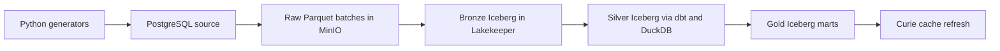

# Ampere data platform

Ampere generates operational data in PostgreSQL and turns it into Iceberg tables on MinIO. Airflow coordinates the daily path, Spark extracts and applies Raw batches, dbt with DuckDB builds Silver and Gold, and Lakekeeper catalogs the Iceberg tables. Curie refreshes its cache after Gold publication succeeds.

## Daily pipeline


```mermaid
flowchart LR
    G[Python generators] --> P[PostgreSQL source]
    P --> R[Raw Parquet batches in MinIO]
    R --> B[Bronze Iceberg in Lakekeeper]
    B --> S[Silver Iceberg via dbt and DuckDB]
    S --> O[Gold Iceberg marts]
    O --> C[Curie cache refresh]
```

The `ampere__pre_raw__generators__daily` DAG starts the daily chain on cron `15 4 * * *` (04:15 in the Airflow DAG timezone). It triggers Raw, Bronze daily, Silver daily, Gold daily, and Curie's cache refresh in sequence. Each downstream DAG is trigger-only and preserves the logical date. A successful Sunday Curie refresh triggers `ampere__housekeeping__iceberg_metadata__weekly`. The full rebuild uses separate Bronze, Silver, and Gold DAGs; catalog initialization is its own manual DAG. See [Airflow orchestration](docs/dataflow/generated/airflow_dag_orchestration.md).

The canonical [contract v3](tools/contracts/ampere_tables.json) defines schemas, physical layouts, write profiles, and maintenance policies for all 42 Iceberg tables. Run `ampere__iceberg__catalog__init` after the owner's catalog cleanup; its lightweight Spark Connect client image uses the persistent Spark service to create empty namespaces and tables and refuses schema/layout conflicts. Contract validation reads Iceberg metadata as bytes so it supports Lakekeeper's gzip-compressed metadata files. Raw writes Parquet files, manifests, success markers, and extraction state. Bronze applies validated batches and records them in its contract-defined apply registry. Snapshot tables retain one latest complete Raw retry for every `snapshot_date`; a superseded retry does not replace a different date or block that date from replay. Silver and Gold run in separate short-lived dbt/DuckDB pods, each staging and testing one layer before publishing. Silver daily `fact_delivery_tracking` and `fact_order_product` publishes use three keyed `order_id` ranges and preserve older target rows outside each partial input. Facts use keyed updates and inserts; complete dimensions and budgets also remove keys absent from their staged source. The Bronze full rebuild replays all validated Raw history; Silver and Gold full rebuilds follow it.

Weekly housekeeping uses a lightweight Spark Connect client image to submit contract-driven data-file compaction, manifest rewrite, snapshot expiration, and orphan cleanup to the existing Spark service. Policies are resolved per table from contract v3. The job checks table schema, partitioning, and properties before maintenance and keeps a 14-day snapshot/orphan retention window.

## Repository layout

- `dags/`: Airflow DAGs, table-group configuration, and SparkApplication templates.
- `docker/spark/iceberg_raw_etl/`: the full Spark image for Raw extraction and Iceberg Bronze application.
- `docker/spark/connect_client/`: the Python-only Spark Connect client image for catalog initialization and housekeeping.
- `docker/dbt_iceberg/` and `dbt_iceberg/`: the dbt v2 runtime, SQL models, tests, and Iceberg publisher.
- `docker/init_source_preparation/` and `docker/order_data_generator/`: source generators.
- `tools/contracts/`: canonical Iceberg contract and shared resolver packaged in Spark, Spark Connect client, and dbt images.
- `tools/budget_generation/`: tracked budget input and daily budget generation.
- `docs/`: generated dataflow diagrams and operational documentation.
- `tests/`: checks for the active Spark and dbt paths.

## Images and releases

A numeric `vX.Y.Z` tag runs [release-images.yml](.github/workflows/release-images.yml). It builds images whose source changed since the previous published tag and retags unchanged images to the new version. The release publishes `ampere-spark-iceberg`, `ampere-dbt-iceberg`, `init-source-preparation`, and `order-data-generator`. Airflow's `ampere_release_version` selects the default tag. `iceberg_spark_image` and `iceberg_dbt_image` are optional Airflow Variables that override individual images; the Spark override applies to both Raw and Bronze. These values are managed in Airflow, not in the common deployment environment.

The Iceberg Spark and dbt workflows build `sha-<commit>` on relevant pushes to `migration/iceberg` and `main`; migration branch pushes also update `migration-latest`. The release workflow uses `GHCR_TOKEN` when present and otherwise `GITHUB_TOKEN` for GHCR access.

## Documentation

[Project dataflow](docs/dataflow/generated/project_dataflow.md), [table groups](docs/dataflow/generated/table_groups.md), [layer responsibilities](docs/dataflow/generated/layer_responsibilities.md), and [Airflow orchestration](docs/dataflow/generated/airflow_dag_orchestration.md) are generated from `docs/dataflow/dataflow.yml`, DAG metadata, and table-group configuration. Regenerate them with:

```bash
uv run python tools/docs/generate_dataflow_docs.py
```

See [the platform overview](docs/README.md), [Bronze runtime](docker/spark/iceberg_raw_etl/README.md), and [Silver/Gold runtime](dbt_iceberg/README.md) for further details.
