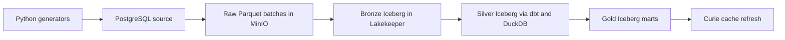

# Ampere data platform

Ampere generates operational data in PostgreSQL and turns it into Iceberg tables on MinIO. Airflow coordinates the daily path, Spark extracts and applies Raw batches, dbt with DuckDB builds Silver and Gold, and Lakekeeper catalogs the Iceberg tables. Curie refreshes its cache after Gold publication succeeds.

## Daily pipeline


```mermaid
flowchart LR
    G[Python generators] --> P[PostgreSQL source]
    P --> R[Raw Parquet batches in MinIO]
    R --> B[Bronze Iceberg in Lakekeeper]
    B --> S[Silver Iceberg via dbt and DuckDB]
    S --> O[Gold Iceberg marts]
    O --> C[Curie cache refresh]
```

The `ampere__pre_raw__generators__daily` DAG starts the daily chain on cron `15 4 * * *` (04:15 in the Airflow DAG timezone). It triggers Raw landing. Raw triggers `ampere__iceberg__bronze__raw_to_iceberg__daily`, Bronze triggers `ampere__iceberg__silver_gold__dbt_duckdb__daily`, and successful Gold publication triggers `ampere__curie__cache_refresh__post_iceberg_gold`. These downstream DAGs have no independent schedule, so each daily chain runs once. The `ampere__iceberg__silver_gold__dbt_duckdb__full_rebuild` DAG is a manual recovery entrypoint. See [Airflow orchestration](docs/dataflow/generated/airflow_dag_orchestration.md).

Raw writes Parquet files, a manifest, a success marker, and extraction state. Bronze applies completed batches by table behavior and records them in an Iceberg apply registry. Daily dbt builds and tests a local slice before publishing it to Lakekeeper. Facts use keyed updates and inserts; complete dimensions and budgets also remove keys absent from their staged source. The manual full rebuild recreates Silver and Gold from all available Bronze history.

## Repository layout

- `dags/`: Airflow DAGs, table-group configuration, and SparkApplication templates.
- `docker/spark/iceberg_raw_etl/`: the Spark image for both Raw extraction and Iceberg Bronze application.
- `docker/dbt_iceberg/` and `dbt_iceberg/`: the dbt v2 runtime, SQL models, tests, and Iceberg publisher.
- `docker/init_source_preparation/` and `docker/order_data_generator/`: source generators.
- `tools/iceberg/contracts/`: Bronze schema contract used by the Spark image.
- `tools/budget_generation/`: tracked budget input and daily budget generation.
- `docs/`: generated dataflow diagrams and operational documentation.
- `tests/`: checks for the active Spark and dbt paths.

## Images and releases

A numeric `vX.Y.Z` tag runs [release-images.yml](.github/workflows/release-images.yml). It builds images whose source changed since the previous published tag and retags unchanged images to the new version. The release publishes `ampere-spark-iceberg`, `ampere-dbt-iceberg`, `init-source-preparation`, and `order-data-generator`. Airflow's `ampere_release_version` selects the default tag. `iceberg_spark_image` and `iceberg_dbt_image` are optional Airflow Variables that override individual images; the Spark override applies to both Raw and Bronze. These values are managed in Airflow, not in the common deployment environment.

The Iceberg Spark and dbt workflows build `sha-<commit>` on relevant pushes to `migration/iceberg` and `main`; migration branch pushes also update `migration-latest`. The release workflow uses `GHCR_TOKEN` when present and otherwise `GITHUB_TOKEN` for GHCR access.

## Documentation

[Project dataflow](docs/dataflow/generated/project_dataflow.md), [table groups](docs/dataflow/generated/table_groups.md), [layer responsibilities](docs/dataflow/generated/layer_responsibilities.md), and [Airflow orchestration](docs/dataflow/generated/airflow_dag_orchestration.md) are generated from `docs/dataflow/dataflow.yml`, DAG metadata, and table-group configuration. Regenerate them with:

```bash
uv run python tools/docs/generate_dataflow_docs.py
```

See [the platform overview](docs/README.md), [Bronze runtime](docker/spark/iceberg_raw_etl/README.md), and [Silver/Gold runtime](dbt_iceberg/README.md) for further details.
