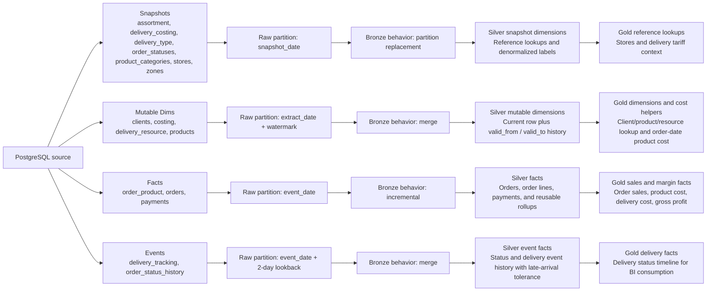
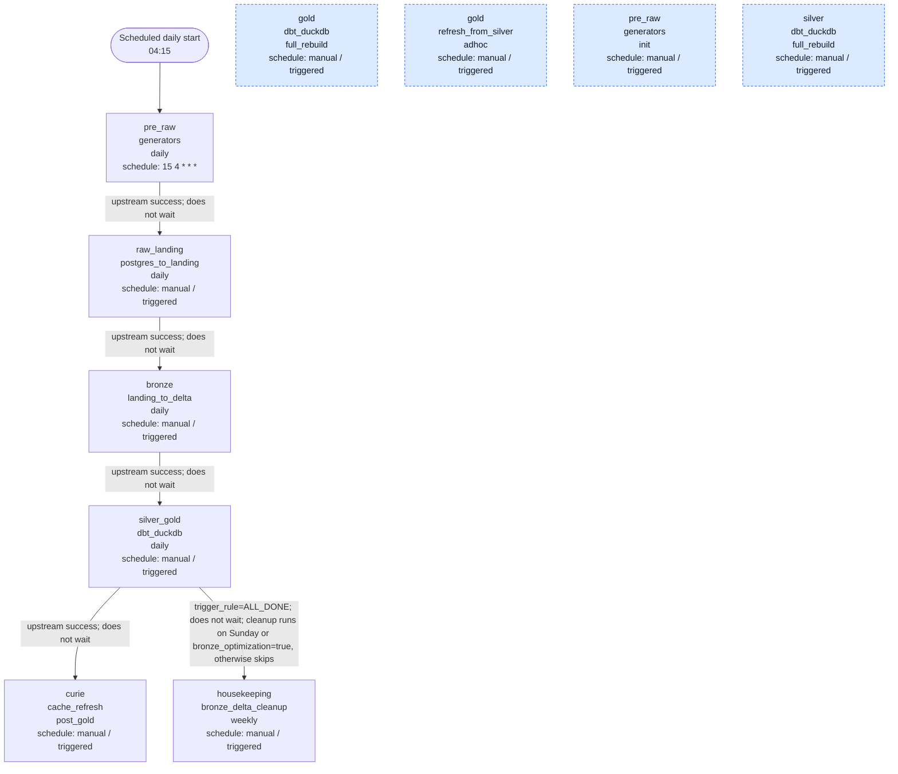

# Ampere Data Platform

Ampere is a home-lab data platform that turns synthetic operational activity into governed analytical marts. Orders, clients, products, payments, delivery events, and cost inputs start as PostgreSQL source data, move through Spark and Delta Lake, and become Silver and Gold tables registered in Unity Catalog OSS.

The project is intentionally compact but production-shaped: each layer has a clear responsibility, pipeline work is orchestrated by Airflow, object storage is MinIO, transformations are versioned in dbt, and documentation is generated from checked-in metadata plus live Unity Catalog snapshots.

The core overview is generated as both a GitHub-rendered page and a reusable Mermaid source file:

- [Project dataflow](dataflow/generated/project_dataflow.md)
- [Project dataflow Mermaid](dataflow/diagrams/project_dataflow.mmd)

## Data Journey

Synthetic source data lands in PostgreSQL first. Spark extracts source tables into immutable Raw parquet batches with manifests and success markers. Bronze applies those batches into Delta tables and records operational state. Silver cleans and shapes analytical entities through DuckDB and dbt. Gold prepares serving marts for margin, sales, delivery, and dimension-style lookups.

The important distinction is not the tool list, but the contract each layer keeps. Raw preserves exactly what was extracted and proves the batch is complete. Bronze turns those batches into Delta tables with behavior-specific write logic. Silver makes the data reusable by applying typing, relationships, and dbt tests. Gold narrows the model into BI-ready marts where order sales, cost, delivery, and gross profit can be read without rebuilding business joins.

```mermaid
flowchart LR
    L_SOURCE["Python generator + PostgreSQL<br/>Logic: Synthetic transactions and mutable source rows.<br/>Python, PostgreSQL<br/>PostgreSQL"]
    L_RAW["Raw landing<br/>Logic: Immutable parquet batches with manifest, success marker, and extract state.<br/>Spark<br/>MinIO, Parquet"]
    L_BRONZE["Bronze<br/>Logic: Delta apply logic by table behavior: replace snapshots, merge mutable/events, increment facts.<br/>Spark, Delta Lake<br/>MinIO, Delta Lake<br/>Unity Catalog OSS"]
    L_SILVER["Silver<br/>Logic: dbt cleans types, joins entities, tests relationships, and publishes reusable Delta tables.<br/>DuckDB, dbt, Delta Lake<br/>MinIO, Delta Lake<br/>Unity Catalog OSS"]
    L_GOLD["Gold<br/>Logic: BI marts calculate sales, delivery, product cost, and order margin.<br/>DuckDB, dbt, Delta Lake<br/>MinIO, Delta Lake<br/>Unity Catalog OSS"]
    L_SERVING["Serving / BI<br/>Logic: Dashboards read governed Gold tables only.<br/>BI / serving"]

    L_SOURCE -->|"Spark"| L_RAW
    L_RAW -->|"Spark + Delta Lake"| L_BRONZE
    L_BRONZE -->|"DuckDB + dbt"| L_SILVER
    L_SILVER -->|"DuckDB + dbt + Delta Lake"| L_GOLD
    L_GOLD -->|"BI / serving"| L_SERVING
```

## Table Movement

Raw and Bronze processing is organized around table behavior rather than one job per table. Snapshot tables are replaced by partition, mutable dimensions are merged, facts are incrementally applied, and event tables use a lookback window to tolerate late changes.

The same group semantics continue after Bronze. Silver keeps reusable analytical tables: snapshot dimensions become lookup dimensions, mutable dimensions preserve validity windows, transactional sources become facts, and event streams keep history. Gold then serves only the narrowed outputs needed for reporting: dimension lookups, order sales, delivery facts, product and delivery cost allocation, and gross margin.

## Orchestration

Airflow starts with the daily source generator and then hands control from one layer to the next without waiting for downstream DAGs to finish. Raw and Bronze are Spark workloads. Silver and Gold share one dbt/DuckDB runtime for the normal daily path so Gold can reuse freshly prepared Silver relations before publishing Delta tables. Bronze housekeeping is fired after Silver/Gold reaches a terminal state and only performs cleanup on Sunday or when `bronze_optimization=true`.

The daily chain is deliberately short: scheduled generation triggers Raw, Raw triggers Bronze, Bronze triggers the combined Silver/Gold job, and Silver/Gold triggers Curie cache refresh. The full rebuild and ad hoc Gold DAGs stay manual because they are recovery entrypoints, not part of normal daily scheduling. Housekeeping is modeled as a non-blocking terminal cleanup trigger so it can run after Silver/Gold is terminal while still skipping work on non-cleanup days.

## Contracts And Governance

Unity Catalog is the metadata authority for Bronze, Silver, and Gold tables. The canonical checked-in contract is `tools/uc/contracts/ampere_tables.json`; local UC notebooks use it to create or repair table registrations. Documentation contracts under `docs/data_contracts/` are compact snapshots extracted from live Unity Catalog state, which lets GitHub-rendered documentation show table inventory without requiring GitHub Actions to reach the cluster.

Layer responsibilities and table inventories are generated here:

- [Layer responsibilities](dataflow/generated/layer_responsibilities.md)
- [Unity Catalog inventory](dataflow/generated/uc_table_inventory.md)
- [Airflow DAG orchestration](dataflow/generated/airflow_dag_orchestration.md)
- [Bronze data contract](data_contracts/bronze.json)
- [Silver data contract](data_contracts/silver.json)
- [Gold data contract](data_contracts/gold.json)

## Operational Shape

The normal daily path is:

1. Generate PostgreSQL source changes.
2. Extract raw landing batches to MinIO.
3. Apply Raw into Bronze Delta tables with registry-backed idempotency.
4. Build and publish Silver and Gold in the shared dbt/DuckDB runtime.
5. Trigger Curie cache refresh and Bronze cleanup as non-blocking terminal handoffs.

Recovery and backfill paths stay separate from the daily chain. Silver full rebuild, Gold full rebuild, and Gold refresh from published Silver are manual DAGs, which keeps normal daily orchestration narrow while preserving explicit repair options.
