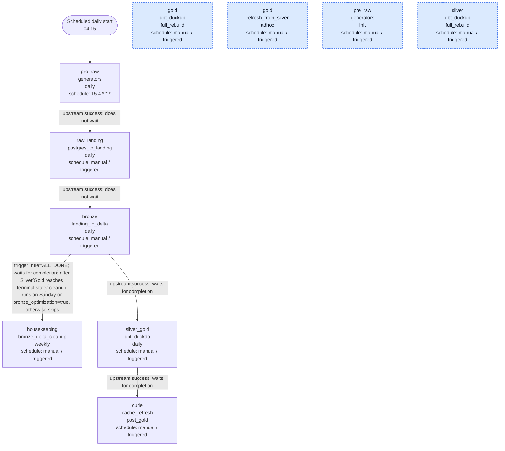

# Airflow DAG orchestration

This page is generated from `dags/my_dags/*.py`. It shows the normal daily chain, manual recovery entrypoints, and the trigger conditions that matter operationally.

Daily work is intentionally narrow: the scheduled generator starts the chain, Raw and Bronze run as Spark jobs, and the combined Silver/Gold dbt job publishes analytical tables. Manual DAGs are kept outside the daily path so rebuilds and ad hoc Gold refreshes are explicit recovery actions.

The housekeeping DAG is triggered after Bronze hands off to Silver/Gold and reaches a terminal state. It still skips work unless the run is Sunday or the Airflow variable `bronze_optimization=true` is set.

## DAG Inventory

| DAG | Schedule | Tags | Source file |
|---|---|---|---|
| `ampere__bronze__landing_to_delta__daily` | manual / triggered | layer:bronze, system:spark, system:minio, catalog:unity, mode:daily | `dags/my_dags/ampere__bronze__landing_to_delta__daily.py` |
| `ampere__curie__cache_refresh__post_gold` | manual / triggered | layer:gold, system:curie, system:api, mode:post_gold | `dags/my_dags/ampere__curie__cache_refresh__post_gold.py` |
| `ampere__gold__dbt_duckdb__full_rebuild` | manual / triggered | layer:gold, system:dbt, system:duckdb, system:minio, mode:full-rebuild | `dags/my_dags/ampere__gold__dbt_duckdb__full_rebuild.py` |
| `ampere__gold__refresh_from_silver__adhoc` | manual / triggered | layer:gold, system:dbt, system:duckdb, system:minio, mode:adhoc | `dags/my_dags/ampere__gold__refresh_from_silver__adhoc.py` |
| `ampere__housekeeping__bronze_delta_cleanup__weekly` | manual / triggered | layer:housekeeping, system:spark, system:delta, system:minio, mode:weekly | `dags/my_dags/ampere__housekeeping__bronze_delta_cleanup__weekly.py` |
| `ampere__pre_raw__generators__daily` | 15 4 * * * | layer:pre_raw, system:postgres, mode:daily | `dags/my_dags/ampere__pre_raw__generators__daily.py` |
| `ampere__pre_raw__generators__init` | manual / triggered | layer:pre_raw, system:postgres, mode:init | `dags/my_dags/ampere__pre_raw__generators__init.py` |
| `ampere__raw_landing__postgres_to_landing__daily` | manual / triggered | layer:raw_landing, system:postgres, system:spark, system:minio, mode:daily | `dags/my_dags/ampere__raw_landing__postgres_to_landing__daily.py` |
| `ampere__silver__dbt_duckdb__full_rebuild` | manual / triggered | layer:silver, system:dbt, system:duckdb, system:minio, mode:full-rebuild | `dags/my_dags/ampere__silver__dbt_duckdb__full_rebuild.py` |
| `ampere__silver_gold__dbt_duckdb__daily` | manual / triggered | layer:silver_gold, layer:silver, layer:gold, system:dbt, system:duckdb, system:minio, mode:daily | `dags/my_dags/ampere__silver_gold__dbt_duckdb__daily.py` |

## Cross-DAG Triggers

| Source DAG | Target DAG | Task | Condition |
|---|---|---|---|
| `ampere__bronze__landing_to_delta__daily` | `ampere__housekeeping__bronze_delta_cleanup__weekly` | `trigger__housekeeping__bronze_delta_cleanup__weekly` | trigger_rule=ALL_DONE; waits for completion; after Silver/Gold reaches terminal state; cleanup runs on Sunday or bronze_optimization=true, otherwise skips |
| `ampere__bronze__landing_to_delta__daily` | `ampere__silver_gold__dbt_duckdb__daily` | `trigger__silver_gold__dbt_duckdb__daily` | upstream success; waits for completion |
| `ampere__pre_raw__generators__daily` | `ampere__raw_landing__postgres_to_landing__daily` | `trigger__raw_landing__postgres_to_landing__daily` | upstream success; does not wait |
| `ampere__raw_landing__postgres_to_landing__daily` | `ampere__bronze__landing_to_delta__daily` | `trigger__bronze__landing_to_delta__daily` | upstream success; does not wait |
| `ampere__silver_gold__dbt_duckdb__daily` | `ampere__curie__cache_refresh__post_gold` | `trigger__curie__cache_refresh__post_gold` | upstream success; waits for completion |
