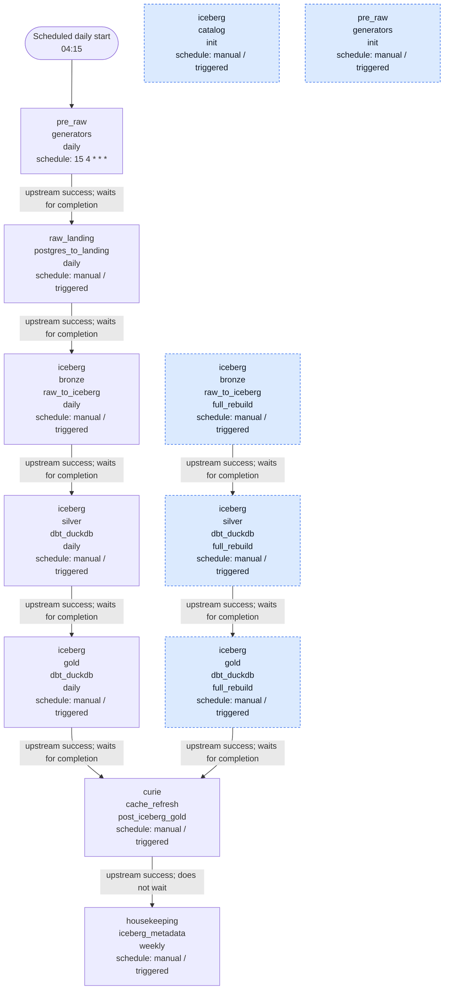

# Airflow DAG orchestration

This page is generated from `dags/my_dags/*.py`. It shows the normal daily chain, manual recovery entrypoints, and the trigger conditions that matter operationally.

The scheduled generator starts the daily chain. Raw and Bronze run as Spark jobs, and isolated dbt pods build and publish Silver, then Gold. Catalog initialization and the Bronze-to-Gold full rebuild are manually run entrypoints.

```mermaid
flowchart TD
    START(["Scheduled daily start<br/>04:15"])
    D_AMPERE__CURIE__CACHE_REFRESH__POST_ICEBERG_GOLD["curie<br/>cache_refresh<br/>post_iceberg_gold<br/>schedule: manual / triggered"]
    D_AMPERE__HOUSEKEEPING__ICEBERG_METADATA__WEEKLY["housekeeping<br/>iceberg_metadata<br/>weekly<br/>schedule: manual / triggered"]
    D_AMPERE__ICEBERG__BRONZE__RAW_TO_ICEBERG__DAILY["iceberg<br/>bronze<br/>raw_to_iceberg<br/>daily<br/>schedule: manual / triggered"]
    D_AMPERE__ICEBERG__BRONZE__RAW_TO_ICEBERG__FULL_REBUILD["iceberg<br/>bronze<br/>raw_to_iceberg<br/>full_rebuild<br/>schedule: manual / triggered"]
    D_AMPERE__ICEBERG__CATALOG__INIT["iceberg<br/>catalog<br/>init<br/>schedule: manual / triggered"]
    D_AMPERE__ICEBERG__GOLD__DBT_DUCKDB__DAILY["iceberg<br/>gold<br/>dbt_duckdb<br/>daily<br/>schedule: manual / triggered"]
    D_AMPERE__ICEBERG__GOLD__DBT_DUCKDB__FULL_REBUILD["iceberg<br/>gold<br/>dbt_duckdb<br/>full_rebuild<br/>schedule: manual / triggered"]
    D_AMPERE__ICEBERG__SILVER__DBT_DUCKDB__DAILY["iceberg<br/>silver<br/>dbt_duckdb<br/>daily<br/>schedule: manual / triggered"]
    D_AMPERE__ICEBERG__SILVER__DBT_DUCKDB__FULL_REBUILD["iceberg<br/>silver<br/>dbt_duckdb<br/>full_rebuild<br/>schedule: manual / triggered"]
    D_AMPERE__PRE_RAW__GENERATORS__DAILY["pre_raw<br/>generators<br/>daily<br/>schedule: 15 4 * * *"]
    D_AMPERE__PRE_RAW__GENERATORS__INIT["pre_raw<br/>generators<br/>init<br/>schedule: manual / triggered"]
    D_AMPERE__RAW_LANDING__POSTGRES_TO_LANDING__DAILY["raw_landing<br/>postgres_to_landing<br/>daily<br/>schedule: manual / triggered"]

    START --> D_AMPERE__PRE_RAW__GENERATORS__DAILY
    D_AMPERE__CURIE__CACHE_REFRESH__POST_ICEBERG_GOLD -->|"upstream success; does not wait"| D_AMPERE__HOUSEKEEPING__ICEBERG_METADATA__WEEKLY
    D_AMPERE__ICEBERG__BRONZE__RAW_TO_ICEBERG__DAILY -->|"upstream success; waits for completion"| D_AMPERE__ICEBERG__SILVER__DBT_DUCKDB__DAILY
    D_AMPERE__ICEBERG__BRONZE__RAW_TO_ICEBERG__FULL_REBUILD -->|"upstream success; waits for completion"| D_AMPERE__ICEBERG__SILVER__DBT_DUCKDB__FULL_REBUILD
    D_AMPERE__ICEBERG__GOLD__DBT_DUCKDB__DAILY -->|"upstream success; waits for completion"| D_AMPERE__CURIE__CACHE_REFRESH__POST_ICEBERG_GOLD
    D_AMPERE__ICEBERG__GOLD__DBT_DUCKDB__FULL_REBUILD -->|"upstream success; waits for completion"| D_AMPERE__CURIE__CACHE_REFRESH__POST_ICEBERG_GOLD
    D_AMPERE__ICEBERG__SILVER__DBT_DUCKDB__DAILY -->|"upstream success; waits for completion"| D_AMPERE__ICEBERG__GOLD__DBT_DUCKDB__DAILY
    D_AMPERE__ICEBERG__SILVER__DBT_DUCKDB__FULL_REBUILD -->|"upstream success; waits for completion"| D_AMPERE__ICEBERG__GOLD__DBT_DUCKDB__FULL_REBUILD
    D_AMPERE__PRE_RAW__GENERATORS__DAILY -->|"upstream success; waits for completion"| D_AMPERE__RAW_LANDING__POSTGRES_TO_LANDING__DAILY
    D_AMPERE__RAW_LANDING__POSTGRES_TO_LANDING__DAILY -->|"upstream success; waits for completion"| D_AMPERE__ICEBERG__BRONZE__RAW_TO_ICEBERG__DAILY

    D_AMPERE__PRE_RAW__GENERATORS__INIT:::manual
    D_AMPERE__ICEBERG__CATALOG__INIT:::manual
    D_AMPERE__ICEBERG__BRONZE__RAW_TO_ICEBERG__FULL_REBUILD:::manual
    D_AMPERE__ICEBERG__SILVER__DBT_DUCKDB__FULL_REBUILD:::manual
    D_AMPERE__ICEBERG__GOLD__DBT_DUCKDB__FULL_REBUILD:::manual
    classDef manual fill:#dbeafe,stroke:#2563eb,color:#111827,stroke-dasharray: 4 3
```

## DAG Inventory

| DAG | Schedule | Tags | Source file |
|---|---|---|---|
| `ampere__curie__cache_refresh__post_iceberg_gold` | manual / triggered | layer:gold, format:iceberg, system:curie, system:api, mode:post_gold | `dags/my_dags/ampere__curie__cache_refresh__post_iceberg_gold.py` |
| `ampere__housekeeping__iceberg_metadata__weekly` | manual / triggered | layer:housekeeping, format:iceberg, system:spark-connect, mode:weekly | `dags/my_dags/ampere__housekeeping__iceberg_metadata__weekly.py` |
| `ampere__iceberg__bronze__raw_to_iceberg__daily` | manual / triggered | layer:bronze, format:iceberg, system:spark, mode:daily | `dags/my_dags/ampere__iceberg__bronze__raw_to_iceberg__daily.py` |
| `ampere__iceberg__bronze__raw_to_iceberg__full_rebuild` | manual / triggered | layer:bronze, format:iceberg, system:spark, mode:full_rebuild | `dags/my_dags/ampere__iceberg__bronze__raw_to_iceberg__full_rebuild.py` |
| `ampere__iceberg__catalog__init` | manual / triggered | layer:catalog, format:iceberg, system:spark, mode:manual | `dags/my_dags/ampere__iceberg__catalog__init.py` |
| `ampere__iceberg__gold__dbt_duckdb__daily` | manual / triggered | layer:gold, format:iceberg, system:dbt, mode:daily | `dags/my_dags/ampere__iceberg__gold__dbt_duckdb__daily.py` |
| `ampere__iceberg__gold__dbt_duckdb__full_rebuild` | manual / triggered | layer:gold, format:iceberg, system:dbt, mode:full_rebuild | `dags/my_dags/ampere__iceberg__gold__dbt_duckdb__full_rebuild.py` |
| `ampere__iceberg__silver__dbt_duckdb__daily` | manual / triggered | layer:silver, format:iceberg, system:dbt, mode:daily | `dags/my_dags/ampere__iceberg__silver__dbt_duckdb__daily.py` |
| `ampere__iceberg__silver__dbt_duckdb__full_rebuild` | manual / triggered | layer:silver, format:iceberg, system:dbt, mode:full_rebuild | `dags/my_dags/ampere__iceberg__silver__dbt_duckdb__full_rebuild.py` |
| `ampere__pre_raw__generators__daily` | 15 4 * * * | layer:pre_raw, system:postgres, mode:daily | `dags/my_dags/ampere__pre_raw__generators__daily.py` |
| `ampere__pre_raw__generators__init` | manual / triggered | layer:pre_raw, system:postgres, mode:init | `dags/my_dags/ampere__pre_raw__generators__init.py` |
| `ampere__raw_landing__postgres_to_landing__daily` | manual / triggered | layer:raw_landing, system:postgres, system:spark, system:minio, mode:daily | `dags/my_dags/ampere__raw_landing__postgres_to_landing__daily.py` |

## Cross-DAG Triggers

| Source DAG | Target DAG | Task | Condition |
|---|---|---|---|
| `ampere__curie__cache_refresh__post_iceberg_gold` | `ampere__housekeeping__iceberg_metadata__weekly` | `trigger__iceberg__housekeeping__weekly` | upstream success; does not wait |
| `ampere__iceberg__bronze__raw_to_iceberg__daily` | `ampere__iceberg__silver__dbt_duckdb__daily` | `trigger__iceberg__silver__dbt_duckdb__daily` | upstream success; waits for completion |
| `ampere__iceberg__bronze__raw_to_iceberg__full_rebuild` | `ampere__iceberg__silver__dbt_duckdb__full_rebuild` | `trigger__iceberg__silver__dbt_duckdb__full_rebuild` | upstream success; waits for completion |
| `ampere__iceberg__gold__dbt_duckdb__daily` | `ampere__curie__cache_refresh__post_iceberg_gold` | `trigger__curie__cache_refresh__post_iceberg_gold` | upstream success; waits for completion |
| `ampere__iceberg__gold__dbt_duckdb__full_rebuild` | `ampere__curie__cache_refresh__post_iceberg_gold` | `trigger__curie__cache_refresh__post_iceberg_gold` | upstream success; waits for completion |
| `ampere__iceberg__silver__dbt_duckdb__daily` | `ampere__iceberg__gold__dbt_duckdb__daily` | `trigger__iceberg__gold__dbt_duckdb__daily` | upstream success; waits for completion |
| `ampere__iceberg__silver__dbt_duckdb__full_rebuild` | `ampere__iceberg__gold__dbt_duckdb__full_rebuild` | `trigger__iceberg__gold__dbt_duckdb__full_rebuild` | upstream success; waits for completion |
| `ampere__pre_raw__generators__daily` | `ampere__raw_landing__postgres_to_landing__daily` | `trigger__raw_landing__postgres_to_landing__daily` | upstream success; waits for completion |
| `ampere__raw_landing__postgres_to_landing__daily` | `ampere__iceberg__bronze__raw_to_iceberg__daily` | `trigger__iceberg__bronze__raw_to_iceberg__daily` | upstream success; waits for completion |
