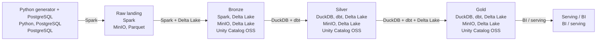

# Project dataflow

This flowchart shows the high-level layer transitions and the engine used between layers.

```mermaid
flowchart LR
    L_SOURCE["Python generator + PostgreSQL<br/>Python, PostgreSQL<br/>PostgreSQL"]
    L_RAW["Raw landing<br/>Spark<br/>MinIO, Parquet"]
    L_BRONZE["Bronze<br/>Spark, Delta Lake<br/>MinIO, Delta Lake<br/>Unity Catalog OSS"]
    L_SILVER["Silver<br/>DuckDB, dbt, Delta Lake<br/>MinIO, Delta Lake<br/>Unity Catalog OSS"]
    L_GOLD["Gold<br/>DuckDB, dbt, Delta Lake<br/>MinIO, Delta Lake<br/>Unity Catalog OSS"]
    L_SERVING["Serving / BI<br/>BI / serving"]

    L_SOURCE -->|"Spark"| L_RAW
    L_RAW -->|"Spark + Delta Lake"| L_BRONZE
    L_BRONZE -->|"DuckDB + dbt"| L_SILVER
    L_SILVER -->|"DuckDB + dbt + Delta Lake"| L_GOLD
    L_GOLD -->|"BI / serving"| L_SERVING
```
