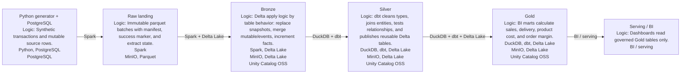

# Project dataflow

This flowchart shows the high-level layer transitions, the main logic inside each layer, and the engine used between layers.

```mermaid
flowchart LR
    L_SOURCE["Python generator + PostgreSQL<br/>Logic: Synthetic transactions and mutable source rows.<br/>Python, PostgreSQL<br/>PostgreSQL"]
    L_RAW["Raw landing<br/>Logic: Immutable parquet batches with manifest, success marker, and extract state.<br/>Spark<br/>MinIO, Parquet"]
    L_BRONZE["Bronze<br/>Logic: Delta apply logic by table behavior: replace snapshots, merge mutable/events, increment facts.<br/>Spark, Delta Lake<br/>MinIO, Delta Lake<br/>Unity Catalog OSS"]
    L_SILVER["Silver<br/>Logic: dbt cleans types, joins entities, tests relationships, and publishes reusable Delta tables.<br/>DuckDB, dbt, Delta Lake<br/>MinIO, Delta Lake<br/>Unity Catalog OSS"]
    L_GOLD["Gold<br/>Logic: BI marts calculate sales, delivery, product cost, and order margin.<br/>DuckDB, dbt, Delta Lake<br/>MinIO, Delta Lake<br/>Unity Catalog OSS"]
    L_SERVING["Serving / BI<br/>Logic: Dashboards read governed Gold tables only.<br/>BI / serving"]

    L_SOURCE -->|"Spark"| L_RAW
    L_RAW -->|"Spark + Delta Lake"| L_BRONZE
    L_BRONZE -->|"DuckDB + dbt"| L_SILVER
    L_SILVER -->|"DuckDB + dbt + Delta Lake"| L_GOLD
    L_GOLD -->|"BI / serving"| L_SERVING
```
