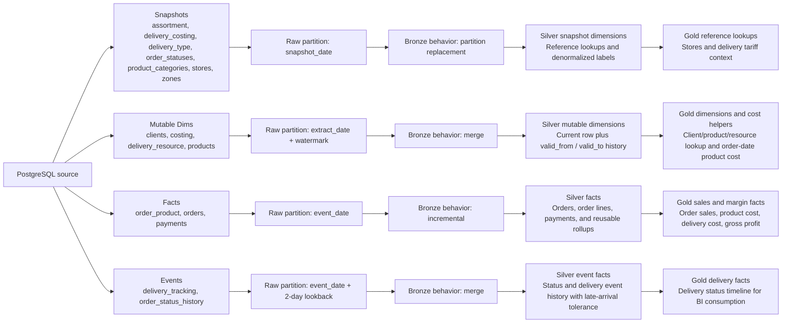

# Table movement

This flowchart shows how source table groups move through Raw, Bronze, Silver, and Gold.

```mermaid
flowchart LR
    PG["PostgreSQL source"]
    G_SNAPSHOTS["Snapshots<br/>assortment, delivery_costing, delivery_type, order_statuses, product_categories, stores, zones"]
    G_SNAPSHOTS_RAW["Raw partition: snapshot_date"]
    G_SNAPSHOTS_BRONZE["Bronze behavior: partition replacement"]
    G_SNAPSHOTS_SILVER["Silver snapshot dimensions<br/>Reference lookups and denormalized labels"]
    G_SNAPSHOTS_GOLD["Gold reference lookups<br/>Stores and delivery tariff context"]
    PG --> G_SNAPSHOTS --> G_SNAPSHOTS_RAW --> G_SNAPSHOTS_BRONZE --> G_SNAPSHOTS_SILVER --> G_SNAPSHOTS_GOLD
    G_MUTABLE_DIMS["Mutable Dims<br/>clients, costing, delivery_resource, products"]
    G_MUTABLE_DIMS_RAW["Raw partition: extract_date + watermark"]
    G_MUTABLE_DIMS_BRONZE["Bronze behavior: merge"]
    G_MUTABLE_DIMS_SILVER["Silver mutable dimensions<br/>Current row plus valid_from / valid_to history"]
    G_MUTABLE_DIMS_GOLD["Gold dimensions and cost helpers<br/>Client/product/resource lookup and order-date product cost"]
    PG --> G_MUTABLE_DIMS --> G_MUTABLE_DIMS_RAW --> G_MUTABLE_DIMS_BRONZE --> G_MUTABLE_DIMS_SILVER --> G_MUTABLE_DIMS_GOLD
    G_FACTS["Facts<br/>order_product, orders, payments"]
    G_FACTS_RAW["Raw partition: event_date"]
    G_FACTS_BRONZE["Bronze behavior: incremental"]
    G_FACTS_SILVER["Silver facts<br/>Orders, order lines, payments, and reusable rollups"]
    G_FACTS_GOLD["Gold sales and margin facts<br/>Order sales, product cost, delivery cost, gross profit"]
    PG --> G_FACTS --> G_FACTS_RAW --> G_FACTS_BRONZE --> G_FACTS_SILVER --> G_FACTS_GOLD
    G_EVENTS["Events<br/>delivery_tracking, order_status_history"]
    G_EVENTS_RAW["Raw partition: event_date + 2-day lookback"]
    G_EVENTS_BRONZE["Bronze behavior: merge"]
    G_EVENTS_SILVER["Silver event facts<br/>Status and delivery event history with late-arrival tolerance"]
    G_EVENTS_GOLD["Gold delivery facts<br/>Delivery status timeline for BI consumption"]
    PG --> G_EVENTS --> G_EVENTS_RAW --> G_EVENTS_BRONZE --> G_EVENTS_SILVER --> G_EVENTS_GOLD
```
