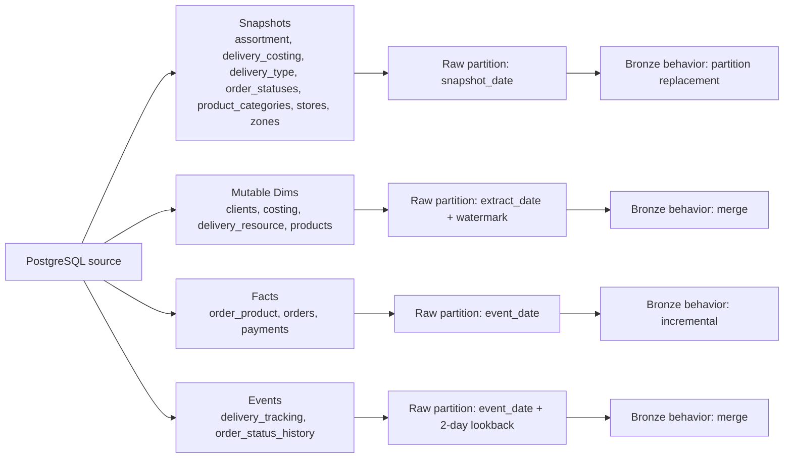

# Raw and Bronze table groups

This flowchart shows how source tables are grouped for raw extraction and bronze Delta application.

```mermaid
flowchart LR
    PG["PostgreSQL source"]
    G_SNAPSHOTS["Snapshots<br/>assortment, delivery_costing, delivery_type, order_statuses, product_categories, stores, zones"]
    G_SNAPSHOTS_RAW["Raw partition: snapshot_date"]
    G_SNAPSHOTS_BRONZE["Bronze behavior: partition replacement"]
    PG --> G_SNAPSHOTS --> G_SNAPSHOTS_RAW --> G_SNAPSHOTS_BRONZE
    G_MUTABLE_DIMS["Mutable Dims<br/>clients, costing, delivery_resource, products"]
    G_MUTABLE_DIMS_RAW["Raw partition: extract_date + watermark"]
    G_MUTABLE_DIMS_BRONZE["Bronze behavior: merge"]
    PG --> G_MUTABLE_DIMS --> G_MUTABLE_DIMS_RAW --> G_MUTABLE_DIMS_BRONZE
    G_FACTS["Facts<br/>order_product, orders, payments"]
    G_FACTS_RAW["Raw partition: event_date"]
    G_FACTS_BRONZE["Bronze behavior: incremental"]
    PG --> G_FACTS --> G_FACTS_RAW --> G_FACTS_BRONZE
    G_EVENTS["Events<br/>delivery_tracking, order_status_history"]
    G_EVENTS_RAW["Raw partition: event_date + 2-day lookback"]
    G_EVENTS_BRONZE["Bronze behavior: merge"]
    PG --> G_EVENTS --> G_EVENTS_RAW --> G_EVENTS_BRONZE
```
